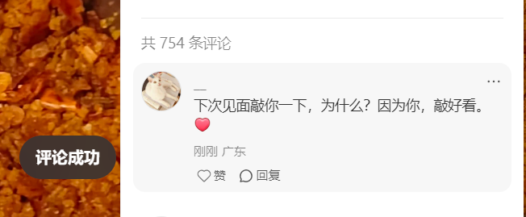
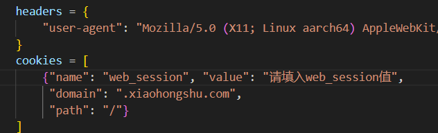
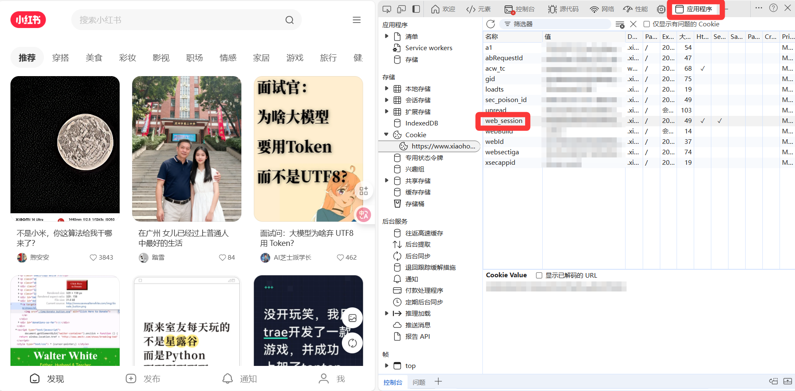

# XhsPost（小红书评论机器人）

> 仅供学习研究与个人自动化演示使用，请遵守平台使用条款与当地法律法规，不要滥用。本工具不对因使用产生的任何后果负责。




一个爱凑热闹的小机器人：打开浏览器溜进小红书「探索」区，漫无目的地逛逛。看到一条就“咔哒”点开，不读不想、不纠结，直接贴上一句小情话，挥手关掉，再去下一条。循环往复，post! post! post! 快乐不间断。

## 需要准备什么

- 已安装 Python 3.8 及以上
- 能联网的环境（脚本会调用情话 API 和打开小红书网页版）
- 浏览器自动化依赖：Playwright（脚本会用到 Chromium）

## 安装依赖

requests
playwright

## 必要配置：Cookie（必须登录）





脚本默认写了示例 Cookie（`web_session`），通常会失效。你需要：

1) 用浏览器登录网页版小红书
2) 打开开发者工具 → Application/存储 → Cookies → 找到域名 `xiaohongshu.com`
3) 复制 `web_session` 的值
4) 打开 `XhsPost.py`，找到如下位置并替换 `value`

```python
cookies = [
    {"name": "web_session", "value": "你的web_session值", "domain": ".xiaohongshu.com", "path": "/"}
]
```

> 如果你更习惯免登录，也可以自行改造上下文持久化或手动登录后再运行。


- 运行后会弹出一个浏览器窗口
- 脚本会自动打开「探索/发现」页
- 终端会提示输入循环轮数 X（比如 5）
- 然后它会：下翻 → 取到当前屏的笔记列表 → 逐条进入 → 填入情话 → 发送 → 返回

## 可以改哪些参数

在 `XhsPost.py` 里：

- `Bottle.timeout_value`：全局超时（毫秒），默认 `60000`
- `human_wait()`：每步之间的随机等待（毫秒范围），默认 3000–5000，可自行调整为更慢更稳
- `headers`：UA 等请求头
- `cookies`：登录态（见上文）

选择器（页面改版时可能需要调整）：
- 容器：`#exploreFeeds`
- 列表项：`.note-item`
- 标题：`.title`
- 作者：`.name`
- 喜欢数：`.count`
- 缩略图：`img`
- 进入笔记：`.cover.mask.ld`
- 评论文本框：`#content-textarea`
- 关闭笔记：`.close.close-mask-dark`

## 常见问题

- 打不开网页 / 超时？
  - 检查网络与代理，适当增大 `timeout_value`
- 一直提示未登录 / 评论失败？
  - 你的 `web_session` 失效了，换新的；或改成手动登录后再运行
- 选择器报错找不到元素？
  - 小红书前端结构更新了，按上面的「选择器」位置逐一核对并修改
- 情话 API 没返回？
  - `loveword()` 返回 `None` 时可改成固定文案（例如：`love = "好喜欢这条笔记！"`）
- 想先“试运行”不真的发？
  - 注释掉发送的两行：
    - `page.locator('#content-textarea').press("Enter")`
    - 以及相关点击/提交；或仅打印 `love` 内容

## 风险与合规

- 请合理设置等待时间与循环次数，避免高频操作
- 仅在取得授权或允许的前提下进行自动化操作
- 请确保你的行为符合小红书平台规则及当地法律

祝你玩的开心，也请文明上网 :)
